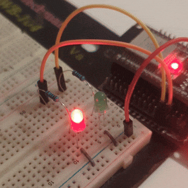
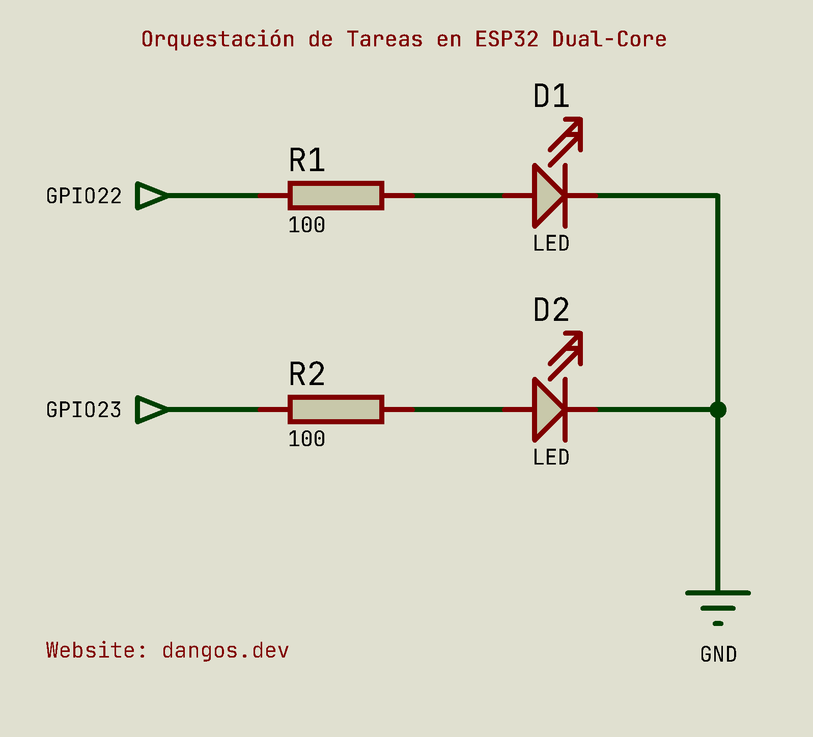

# Orquestación de Tareas en ESP32 Dual-Core

Este proyecto demuestra el _multithreading_ en el ESP32 controlando dos tareas paralelas que se ejecutan en los dos
núcleos del ESP32. Cada tarea controla un LED conectado a un pin específico con tiempos de parpadeo distintos.

