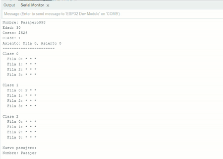

# Sistema de Reserva de Asientos de Avión con ESP32 y Matriz LED (Ejercicio ITLA-TDS001)

Este proyecto es una solución al ejercicio propuesto por el Prof. Jean Charly Ph. Joseph S. del ITLA, implementando un sistema de reserva de asientos para un avión simulado. Se utiliza un microcontrolador ESP32, una matriz LED 8x8, un LED RGB y un botón. El sistema gestiona la asignación de asientos en tres clases (Primera, Segunda y Tercera) según el costo y la edad, mostrando la ocupación en la matriz LED y la clase del último pasajero con el LED RGB.

## Descripción del Ejercicio

El ejercicio original plantea los siguientes requisitos:

*   **Clasificación de Pasajeros:**
    *   Primera Clase: Pasajeros que pagan más de 1000 pesos.
    *   Segunda Clase: Pasajeros que pagan 500 pesos.
    *   Tercera Clase: Pasajeros que pagan menos de 500 pesos.
*   **Preferencia de Asientos (Edad):**
    *   Primera Clase: Mayores de 25 años en asientos de los extremos (ventana/pasillo).
    *   Todas las Clases:
        *   Menores de 15 años y mayores de 50 años: Asientos del centro.
        *   Entre 15 y 50 años: Asientos de los extremos.
*   **Disponibilidad:** Si todos los asientos de una clase están ocupados, se debe indicar que se busque otro vuelo.
*   **Visualización:** Mostrar el nombre del pasajero asignado a cada asiento (en el código, se muestra la inicial del nombre).

## Componentes

*   ESP32 (con soporte para FreeRTOS)
*   Matriz LED 8x8 (con controlador DM11A88)
*   LED RGB (ánodo común)
*   Botón pulsador

## Conexiones

*   **Matriz LED:**
    *   DI (Data In):   GPIO 23 (VSPI MOSI)
    *   CLK (Clock):    GPIO 18 (VSPI CLK)
    *   LAT (Latch):    GPIO 5  (VSPI CS0)
*   **Botón:**
    *   Un pin a GPIO 15 (HSPI CS0)
    *   Otro pin a GND
*   **LED RGB:**
    *   Pin Rojo (R):   GPIO 4
    *   Pin Verde (G):  GPIO 16
    *   Pin Azul (B):   GPIO 17
    *   Ánodo común a 3.3V

## Estructura del Proyecto

*   **`ITLA-TDS001-Matrices.ino`:**  Código principal del programa.
*   **`ControlDM11A88.h`:**  Cabecera de la librería `ControlDM11A88`.
*   **`ControlDM11A88.cpp`:**  Implementación de la librería `ControlDM11A88`.